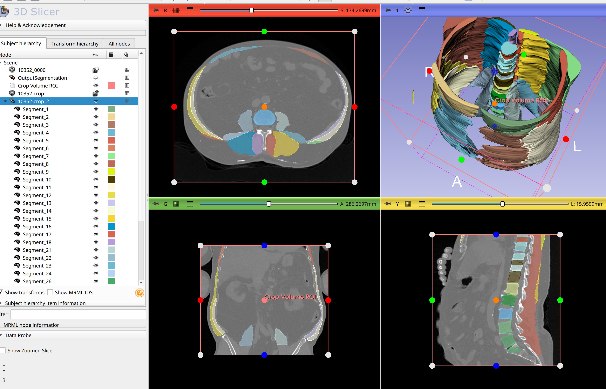

# 3D Muscle Segmentation using nnU-Net

This repository provides the code, pre-trained model, and example training data for **3D muscle segmentation** using the **nnU-Net framework**. The project focuses on segmenting major thoracic and lumbar spinal muscles from clinical CT scans, supporting applications in radiotherapy planning, clinical research, and automated muscle analysis.

---

## Table of Contents

1. [Project Overview](#project-overview)  
2. [Installation and Usage](#installation)    
3. [Input Data Requirements](#input-data-requirements)  
4. [Model Details](#model-details)  
5. [Example Outputs](#example-outputs)  
6. [Anatomical Structure Table](#anatomical-structure-table)  
7. [Citation](#citation)  
8. [Acknowledgements](#acknowledgements)  
9. [License](#license)  
10. [Contact](#contact)  

---

## Project Overview

This project automates the segmentation of major spinal muscles from thoracic and lumbar CT images using the **nnU-Net framework**. Ground-truth muscle annotations were generated following established manual segmentation protocols.

### Key Features
- **Input**: Clinical thoracic and lumbar CT scans with the following field of view (FOV):  
  - **Skin-to-skin FOV**  
- **Output**: Binary segmentation masks for major spinal muscles, including:  
  - Multifidus  
  - Erector Spinae  
  - Psoas  
  - Quadratus Lumborum  
  - Rectus Abdominis  

### Repository Contents
This repository includes:
1. **Pre-trained Model**:  
   Split zip files of model weights in `models/v.0.0.1/`.  
2. **Instructions**: Detailed guidance for reproducing segmentation results.

### Applications
The project supports:  
- Clinical radiotherapy treatment planning  
- Automated assessment of spinal muscle anatomy  
- Research into muscle-related diseases and sarcopenia  

---

## Installation

This project can be run locally using nnU-Net commands for full flexibility and automation.

---

### Run Locally Using nnUNet Commands

#### Prerequisites

1. Install Python (3.8 or later).
2. Install the nnU-Net framework and required dependencies:
   ```bash
   pip install nnunet numpy SimpleITK torch torchvision
   ```
3. Run the `download_model.py` script from the repository root:
   ```bash
   python download_model.py
   ```
4. Extract the combined zip file:
   ```bash
   unzip models/v.0.0.1/nnU-Net_results.zip -d /path/to/nnUNet_results
   ```

#### Running nnU-Net

1. Set the path to your nnU-Net results directory:
   ```bash
   export nnUNet_results="/path/to/nnUNet_results"
   ```

2. Ensure your input .nrrd files are named correctly (ending with `_0000.nrrd`) before processing.

3. Run the segmentation command:
   ```bash
   nnUNetv2_predict -i "/path/to/input" -o "/path/to/output" -d 001 -c 3d_fullres
   ```
   - Replace `/path/to/input` and `/path/to/output` with your actual input and output directories (folders).
   - Replace `001` with the appropriate dataset ID for your project.

---

## Input Data Requirements
The protocols for the data used for training and testing are discussed in the corresponding section of the paper. Refer to the publication for detailed information on imaging protocol parameters.

---

## Model Details
- **Training Framework**: nnU-Net (2D Configuration)
- **Ground Truth**: Manual segmentations from thoracic (T4-T7) and lumbar (L2-L5) vertebral levels
- **Evaluation**: Segmentation accuracy validated using a Likert scale (0-5) for clinical acceptability.
- **Performance**: High inter- and intra-rater reliability (ICC: 0.84-0.99).

---

## Example Outputs
Below is an example segmentation output overlaying the binary masks on a CT slice:



This image can be reproduced in approximately **1 minute and 20 seconds** using an **NVIDIA RTX A6000 (48 GB VRAM)** GPU on a system with an **AMD Ryzen Threadripper PRO 3975WX 32-core processor** and **258 GB of RAM**.


---

## Anatomical Structure Table

| Anatomical Structure      | Side   | Vertebral Levels | nnUNet Index |
|---------------------------|--------|------------------|--------------|
| Pectoralis Major         | Right  | T4 - T9          | 1           |
| Pectoralis Major         | Left   | T4 - T9          | 2           |
| Rectus Abdominis         | Right  | T10 - L5         | 3           |
| Rectus Abdominis         | Left   | T10 - L5         | 4           |
| Serratus Anterior        | Right  | T4 - T11         | 5           |
| Serratus Anterior        | Left   | T4 - T11         | 6           |
| Latissimus Dorsi         | Right  | T4 - L3          | 7           |
| Latissimus Dorsi         | Left   | T4 - L3          | 8           |
| Trapezius                | Right  | T4 - T11         | 9           |
| Trapezius                | Left   | T4 - T11         | 10          |
| External Oblique         | Right  | T10 - L5         | 11          |
| External Oblique         | Left   | T10 - L5         | 12          |
| Internal Oblique         | Right  | L2 - L5          | 13          |
| Internal Oblique         | Left   | L2 - L5          | 14          |
| Erector Spinae           | Right  | T4 - L5          | 15          |
| Erector Spinae           | Left   | T4 - L5          | 16          |
| Transversospinalis       | Right  | T4 - L5          | 17          |
| Transversospinalis       | Left   | T4 - L5          | 18          |
| Psoas Major              | Right  | L1 - L5          | 21          |
| Psoas Major              | Left   | L1 - L5          | 22          |
| Quadratus Lumborum       | Right  | L1 - L4          | 23          |
| Quadratus Lumborum       | Left   | L1 - L4          | 24          |

### Remark:
Please note that the vertebral segmentations (#28 and higher) depending on the vertebral level present, should not be used for model creations. We have a separate accurate spine vertebral segmenter for cancer spines, or please use TotalSegmentator to segment non-cancer vertebrae ([TotalSegmentator Repository](https://github.com/wasserth/TotalSegmentator)).

---

## Citation

If you use this repository, please cite:

**Automated Segmentation of Trunk Musculature with a Deep CNN Trained from Sparse Annotations in Radiation Therapy Patients with Metastatic Spine Disease**  
*Ron N. Alkalay et al.*  
[DOI: 10.1101/2025.01.13.25319967](https://www.medrxiv.org/content/10.1101/2025.01.13.25319967v1)


For now, cite this repository:
```
@article {Hong2025.01.13.25319967,
	author = {Hong, Vy and Pieper, Steve and James, Joanna and Anderson, Dennis E and Pinter, Csaba and Chang, Yi Shuen and Aslan, Bulent and Kozono, David and Doyle, Patrick F and Caplan, Sarah and Kang, Heejoo and Balboni, Tracy and Spektor, Alexander and Huynh, Mai Anh and Keko, Mario and Kikinis, Ron and Hackney, David B and Alkalay, Ron N},
	title = {Automated Segmentation of Trunk Musculature with a Deep CNN Trained from Sparse Annotations in Radiation Therapy Patients with Metastatic Spine Disease},
	elocation-id = {2025.01.13.25319967},
	year = {2025},
	doi = {10.1101/2025.01.13.25319967},
	publisher = {Cold Spring Harbor Laboratory Press},
	URL = {https://www.medrxiv.org/content/early/2025/01/20/2025.01.13.25319967},
	eprint = {https://www.medrxiv.org/content/early/2025/01/20/2025.01.13.25319967.full.pdf},
	journal = {medRxiv}
}
```

---

## Acknowledgements
This work was supported by:
- **National Institute of Arthritis and Musculoskeletal and Skin Diseases**: Research Project Grants (AR055582, R56AR075964, and AR075964) for R. Alkalay and D. Anderson.
- **The National Institute of Biomedical Imaging and Bioengineering** Neuroimage Analysis Center (P41 EB015902) for Dr. S. Pieper.

Special thanks to contributors:
- Ron N. Alkalay, Beth Israel Deaconess Medical Center, Harvard Medical School, Boston, MA
- Dennis Anderson, Beth Israel Deaconess Medical Center, Harvard Medical School, Boston, MA
- Joanna James, Beth Israel Deaconess Medical Center, Harvard Medical School, Boston, MA
- Steve Pieper, Isomics, Inc., Cambridge, MA 02138
- Csaba Pinter, Ebatinca SL, Las Palmas de Gran Canaria, Spain
- Vy Hong, Technical University of Munich
- Nils Rehtanz, Technical University of Munich
---

## License
This project is licensed under the Apache 2.0 License. See the LICENSE file in the repository for details.

---

## Contact
For questions, please contact:
- **Ron N. Alkalay**  
  Beth Israel Deaconess Medical Center, Harvard Medical School  
  Email: [rn_alkalay@bidmc.harvard.edu](mailto:rn_alkalay@bidmc.harvard.edu)

