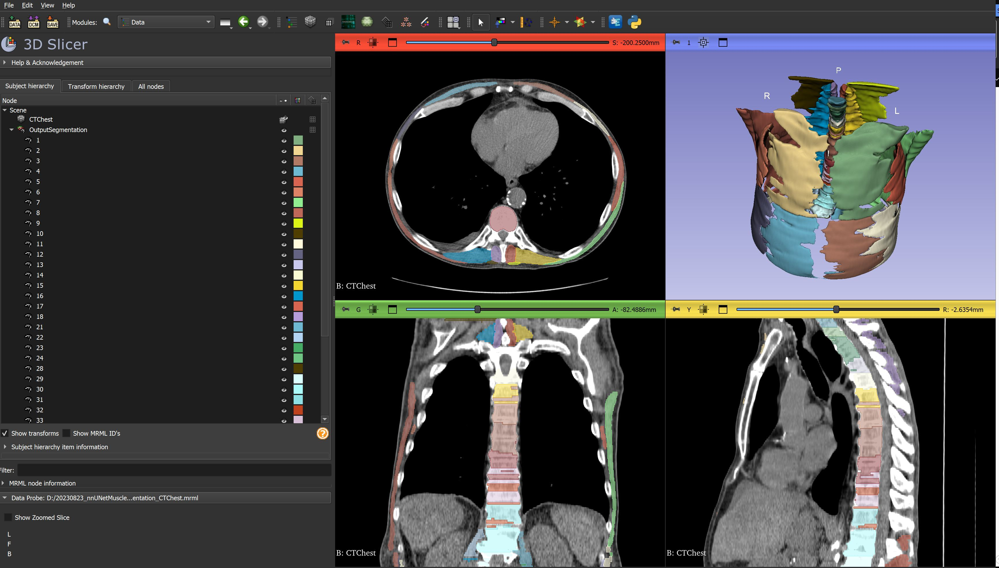

# 3D Muscle Segmentation using nnU-Net

This repository provides the code, pre-trained model, and example training data for **3D muscle segmentation** using the **nnU-Net framework**. The project focuses on segmenting major thoracic and lumbar spinal muscles from clinical CT scans, supporting applications in radiotherapy planning, clinical research, and automated muscle analysis.

---

## Table of Contents

1. [Project Overview](#project-overview)  
2. [Installation and Usage](#installation)    
3. [Input Data Requirements](#input-data-requirements)  
4. [Model Details](#model-details)  
5. [Example Outputs](#example-outputs)  
6. [Citation](#citation)  
7. [Acknowledgements](#acknowledgements)  
8. [License](#license)  
9. [Contact](#contact)  

---

## Project Overview

This project automates the segmentation of major spinal muscles from thoracic and lumbar CT images using the **nnU-Net framework**. Ground-truth muscle annotations were generated following established manual segmentation protocols.

### Key Features
- **Input**: Clinical thoracic and lumbar CT scans with two supported fields of view (FOV):  
  - **Skin-to-skin FOV**  
  - **16cm FOV**  
- **Output**: Binary segmentation masks for major spinal muscles, including:  
  - Multifidus  
  - Erector Spinae  
  - Psoas  
  - Quadratus Lumborum  
  - Rectus Abdominis  

### Repository Contents
This repository includes:
1. **Pre-trained Model**:  
   `nnUNetTrainer_2000epochs_NoMirroring__nnUNetPlans__2d.zip` (2.5GB)  
2. **Example Training Data**:  
   `nnmusc-2023-08-22.tar.gz` (8.5GB)  
3. **Instructions**: Detailed guidance for reproducing segmentation results.

### Applications
The project supports:  
- Clinical radiotherapy treatment planning  
- Automated assessment of spinal muscle anatomy  
- Research into muscle-related diseases and sarcopenia  

---

## Installation

This project can be run in two ways:

1. **Through the 3D Slicer nnU-Net Extension** (recommended for ease of use)
2. **Locally using nnUNet commands** (for full flexibility and automation)

### Prerequisites

- **Python** (3.8 or later)
- **3D Slicer** ([Download here](https://www.slicer.org/))
- **nnU-Net** framework ([Installation Guide](https://github.com/MIC-DKFZ/nnUNet))
- **Required Python packages**:
  ```bash
  pip install numpy SimpleITK torch torchvision
  ```

---

### Option 1: 3D Slicer nnU-Net Extension

1. **Install 3D Slicer**:

   - Download and install from the official site: [3D Slicer Download](https://www.slicer.org/)

2. **Install the nnU-Net Extension**:

   - Follow the setup guide: [SlicerNNUnet Extension](https://github.com/KitwareMedical/SlicerNNUnet)

3. **Load the Pre-trained Model**:

   - Download the model weights:\
     [Pre-trained Model - nnUNetTrainer\_2000epochs\_NoMirroring\_\_nnUNetPlans\_\_2d.zip](<Link to release>)
   - Extract the model files and configure them in the Slicer nnU-Net module.

4. **Run the Segmentation**:

   - Prepare your input CT data in **DICOM** or **NIfTI** format.
   - Use the nnU-Net module in 3D Slicer to perform the segmentation and generate output masks.

---

### Option 2: Run Locally Using nnUNet Commands

1. **Clone the Repository**:

   ```bash
   git clone https://github.com/nilsrehtanz/dl-muscle-segmentation.git
   cd dl-muscle-segmentation
   ```

2. **Install nnU-Net**:\
   Follow the official installation guide:

   ```bash
   pip install nnunet
   ```

3. **Set Up the Pre-trained Model**:

   - Download the model weights:\
     [Pre-trained Model - nnUNetTrainer\_2000epochs\_NoMirroring\_\_nnUNetPlans\_\_2d.zip](<Link to release>)
   - Extract the files:
     ```bash
     mkdir -p nnUNet_pretrained
     unzip nnUNetTrainer_2000epochs_NoMirroring__nnUNetPlans__2d.zip -d nnUNet_pretrained
     ```

4. **Prepare Input Data**:\
   If your CT data is in **DICOM** format, convert it to NIfTI using `dcm2niix`:

   ```bash
   dcm2niix -o /path/to/output /path/to/input_dicom
   ```

5. **Run Inference**:\
   Perform segmentation using the following command:

   ```bash
   nnUNet_predict -i /path/to/input_nifti \
                  -o /path/to/output_masks
   ```

   - Replace `/path/to/input_nifti` and `/path/to/output_masks` with your paths.

---

## Input Data Requirements
- **CT Scans**:
  - Slice thickness: 0.5mm or 1.25mm
  - Pixel size: 0.31mm x 0.31mm (FOV A) or 0.70-0.98mm (FOV B)
  - Field of View (FOV): Skin-to-skin or 16cm

Refer to **Supplemental Table S.1** for detailed imaging protocol parameters.

---

## Model Details
- **Training Framework**: nnU-Net (2D Configuration)
- **Ground Truth**: Manual segmentations from thoracic (T4-T7) and lumbar (L2-L5) vertebral levels
- **Evaluation**: Segmentation accuracy validated using a Likert scale (0-5) for clinical acceptability.
- **Performance**: High inter- and intra-rater reliability (ICC: 0.84-0.99).

---

## Example Outputs
Below is an example segmentation output overlaying the binary masks on a CT slice:



---

## Citation
If you use this repository in your work, please cite:

> **3D Muscle Segmentation using nnU-Net**
> Ron N. Alkalay et al.
> [Arxiv Link!!!!]

For now, cite this repository:
```
@misc{3dmuscle_nnUNet,
  author = {Alkalay, Ron N.},
  title = {3D Muscle Segmentation using nnU-Net},
  year = {2024},
  howpublished = {GitHub repository},
  url = {https://github.com/nilsrehtanz/dl-muscle-segmentation}
}
```

---

## Acknowledgements
This work was supported by:
- **NIH Grant Numbers**: R01 (Alkalay and Anderson)
- **Neuroimage Analysis Center**: P41 EB015902

Special thanks to contributors:
- Ron N. Alkalay, Beth Israel Deaconess Medical Center, Harvard Medical School
- Dennis Anderson, Beth Israel Deaconess Medical Center, Harvard Medical School
- Csaba Pintér, Steve Pieper, Vy Hong

---

## License
This project is licensed under the Apache 2.0 License. See [LICENSE.txt](LICENSE.txt) for details.

---

## Contact
For questions, please contact:
- **Ron N. Alkalay**  
  Beth Israel Deaconess Medical Center, Harvard Medical School
  Email: [rn_alkalay@bidmc.harvard.edu](mailto:rn_alkalay@bidmc.harvard.edu)
